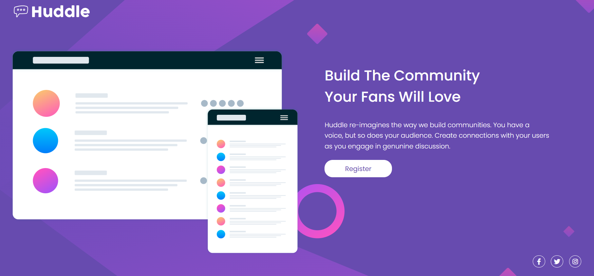
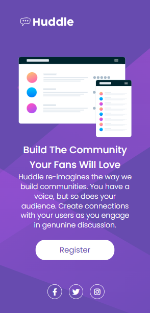

  <h1>Página de Landing Huddle com Seção Introdutória</h1>
  
Este projeto é uma página de landing page desenvolvida como solução para a primeira Quest do curso Dev Quest. Ele exibe um design moderno e simples para promover a plataforma Huddle, que enfatiza a construção de comunidades por meio de engajamento genuíno e discussões. A página é totalmente responsiva, garantindo uma boa visualização em diferentes dispositivos.

  <h2>Índice</h2>
  <ul>
    <li><a href="#recursos">Recursos</a></li>
    <li><a href="#tecnologias">Tecnologias Utilizadas</a></li>
    <li><a href="#comecando">Começando</a></li>
    <li><a href="#estrutura">Estrutura de Arquivos</a></li>
    <li><a href="#capturas">Capturas de Tela</a></li>
    <li><a href="#agradecimentos">Agradecimentos</a></li>
  </ul>

  <h2 id="recursos">Recursos</h2>
  <ul>
    <li><strong>Layout Responsivo:</strong> O design ajusta-se perfeitamente a diferentes tamanhos de tela usando media queries.</li>
    <li><strong>Design Moderno:</strong> Layout simples e atraente utilizando CSS e fontes modernas.</li>
    <li><strong>Efeitos de Hover:</strong> Efeitos de interação em botões e ícones.</li>
    <li><strong>Conteúdo Voltado para a Comunidade:</strong> Texto envolvente e chamada para ação incentivando o registro de usuários.</li>
  </ul>

  <h2 id="tecnologias">Tecnologias Utilizadas</h2>
  <ul>
    <li><strong>HTML5:</strong> Estrutura e semântica.</li>
    <li><strong>CSS3:</strong> Estilização do layout, animações e design responsivo.</li>
    <li><strong>Font Awesome:</strong> Ícones para redes sociais.</li>
    <li><strong>Google Fonts:</strong> Fontes personalizadas para estilo visual coeso.</li>
  </ul>

  <h2 id="comecando">Começando</h2>
  
Para configurar e executar o projeto localmente, siga estas etapas:

  <pre><code>1. Clone o repositório:
git clone https://github.com/seu-usuario/huddle-landing-page.git

2. Navegue para a pasta do projeto:
cd huddle-landing-page

3. Abra o arquivo `index.html` no seu navegador de preferência para visualizar a landing page.</code></pre>

  <h2 id="estrutura">Estrutura de Arquivos</h2>
  <pre><code>huddle-landing-page/
├── index.html
├── src/
│   ├── css/
│   │   ├── reset.css
│   │   ├── estilos.css
│   │   └── responsivo.css
│   └── images/
│       ├── favicon-32x32.png
│       ├── logo.svg
│       ├── illustration-mockups.svg
│       └── bg-desktop.svg
└── README.md</code></pre>
  
<strong>index.html:</strong> Arquivo HTML contendo a estrutura do projeto.

  
<strong>reset.css:</strong> Reset de CSS para normalizar o estilo padrão dos elementos HTML em todos os navegadores.

  
<strong>estilos.css:</strong> Estilos principais do projeto.

  
<strong>responsivo.css:</strong> Estilos responsivos para visualização em dispositivos móveis e tablets.

  <h2 id="capturas">Capturas de Tela</h2>
  <h3>Versão desktop:</h3>
  
<h3>Versão mobile:</h3>
  
  <h2 id="agradecimentos">Agradecimentos</h2>
  
- <strong>Dev Quest</strong> pelo desafio da primeira Quest e pelos ensinamentos dado até o atual momento.

 
</body>

</html>
